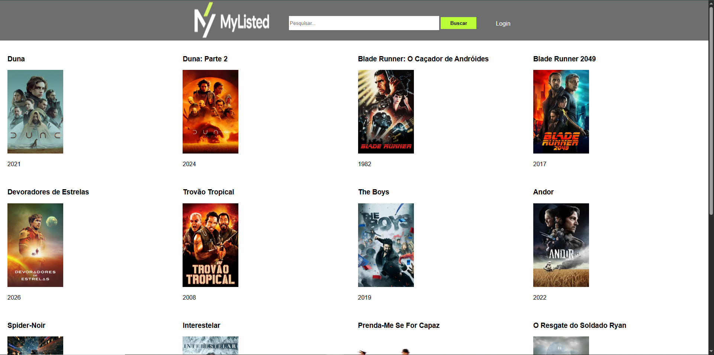
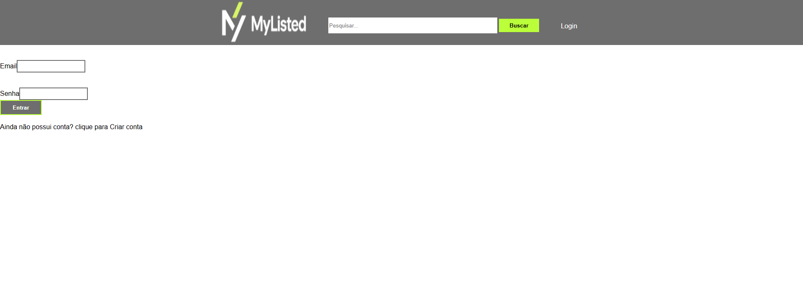
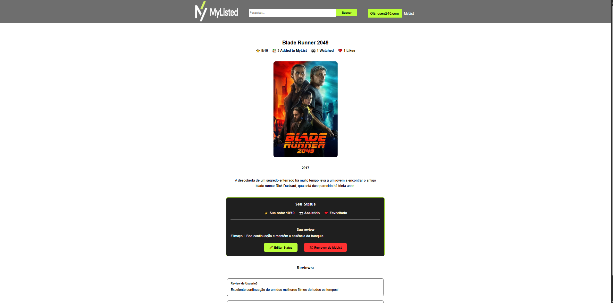
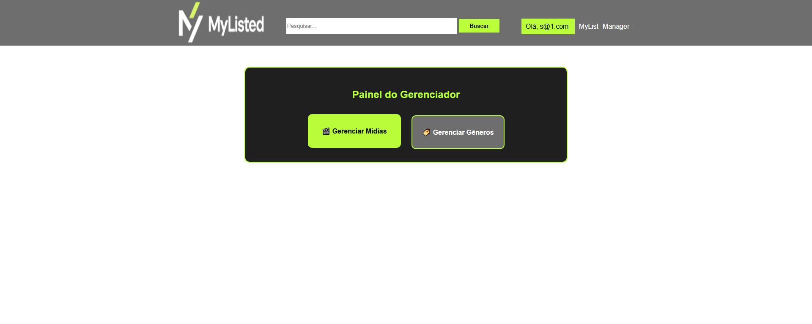
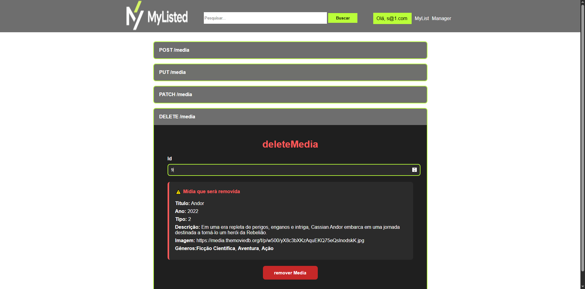

# 🎬 MyLIsted

MyListed is a full-stack web application for managing media, including movies, TV shows, and books. It allows users to manage their personal media list, write reviews, rate media, mark items as watched, or mark them as favorites. Managers can create, edit, and delete media and genres through a dedicated management dashboard. The project was built with Angular, ASP.NET Core, Entity Framework Core, and SQL Server.

## 📸 Screenshots

### Home


### Login


### Media Details


### Manager Dashboard


### Media Management


## ✨ Features
- User authentication with ASP.NET Core Identity
- JWT-based authentication and authorization
- CRUD operations for media
- CRUD operations for genres
- User media management (reviews, ratings, watched status, favorites)
- Protected API endpoints with role-based authorization
- Media search functionality
- Media details page
- Dedicated management dashboard


## 🛠️ Technologies

### Frontend
- Angular
- TypeScript
- HTML5
- CSS3

### Backend
- ASP.NET Core Web API
- Entity Framework Core
- ASP.NET Core Identity
- JWT Authentication
- Swagger

### Database
- MySQL

### Tools
- Git
- GitHub

## 🏛️ Architecture
The application follows a client-server architecture where the Angular frontend communicates with an ASP.NET Core RESTful API secured with JWT authentication. Data persistence is handled through Entity Framework Core and MySQL.

## 🚀 Getting Started

### Prerequisites

Before running the project, make sure you have installed:

- .NET 8 SDK
- Node.js
- Angular CLI
- MySQL

### Clone the repository

```bash
git clone https://github.com/your-username/MyListed.git
cd MyListed
```

### Configure User Secrets

The backend uses .NET User Secrets to store sensitive information.

Configure the following secrets before running the application:

- `ConnectionStrings:DefaultConnection` (MySQL connection string)
- `Jwt:Key` (JWT signing key)

### Apply database migrations

```bash
dotnet ef database update
```

### Run the backend

```bash
dotnet run
```

The backend API will be available at:

```text
https://localhost:7219
```

The Swagger UI will be available at:

```text
https://localhost:7219/swagger/index.html
```

### Run the frontend

```bash
npm install
npm start
```

The Angular application will be available at `http://localhost:4200`.


